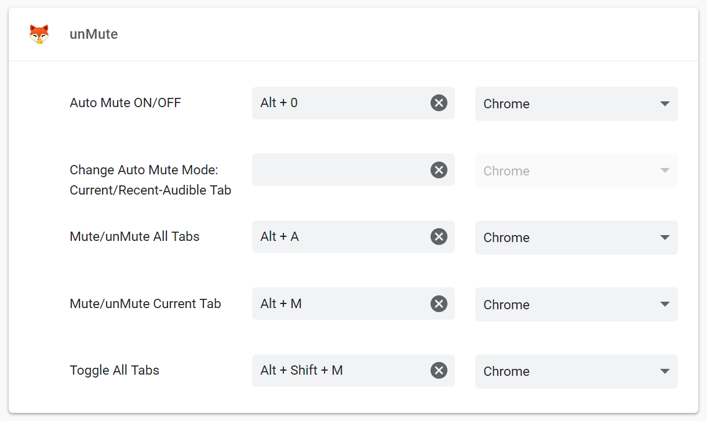
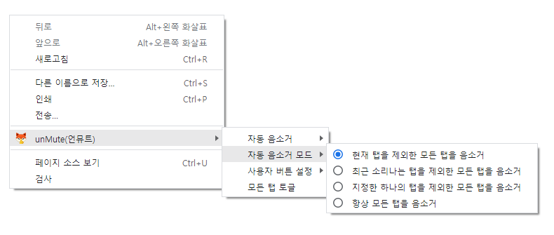

<h1 align="center"> unMute(언뮤트)</h1></p>

<p align="center">
Manually/Automatically Mute your tabs for Google Chrome™.
</p><hr>
<p align="center">
<a href="https://chrome.google.com/webstore/detail/unmute/lfedioibcednammacdoioeonimdbpige"><span>Install at Chrome Web Store</span></a><br>
<a href="https://chrome.google.com/webstore/detail/unmute/lfedioibcednammacdoioeonimdbpige"></a>
</p><hr>

<span style="font-size:0.75em">_Read this in other languages: [English](README.md), [한국어](README.ko.md)._</span>

## Features

- 현재 탭 음소거/음소거 해제
- 현재/최근 소리나는/지정된 탭 제외하고 모든 탭 자동 음소거
- 항상 모든 탭 음소거
- 모든 탭 음소거 토글
- 사용자 버튼 설정

## ChangeLog

- V2

  - 2.0.0: 매니페스트 V3으로 변경 및 모든 코드 새로 작성

- Legacy

  - 1.8: 특정한 탭을 제외하고 모든 탭 자동 음소거 추가
  - 1.7: 항상 모든 탭 음소거 추가
  - 1.6: 사용자 버튼 옵션 추가
  - 1.5: 변경사항 페이지 및 알림 추가
  - 1.4: 최근에 소리난 탭을 제외하고 모든 탭 자동 음소거 추가
  - 1.3: 옵션 페이지 추가
  - 1.2: 현재 탭을 제외하고 모든 탭 자동 음소거 추가
  - 1.1: 컨텍스트 메뉴 추가
  - 1.0: 초기 출시

## Known Issues

- 간혈적으로 확정자가 멈춤 (탭을 새로고침 하면 정상 작동 됨)

## ToDo

- improve Options UI
- and more...

## ScreenShot




## License

```

```
