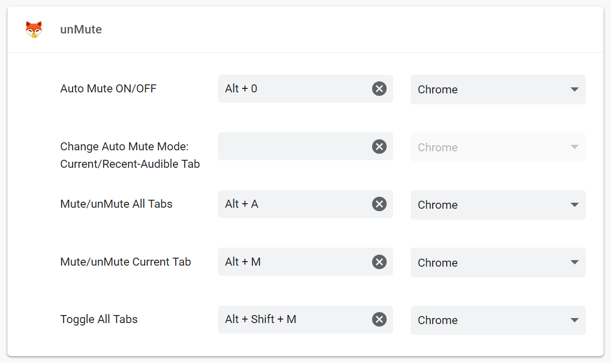
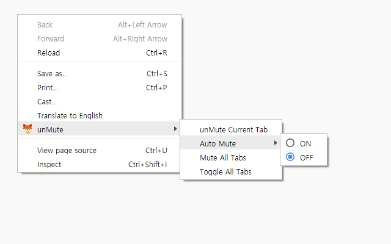

#  unMute

Manually/Automatically Mute your tabs for Chrome.

### Features

- Mute/unMute Current Tab
- Auto Mute All Tabs except Current/Recent-Audible/Specified Tab
- Always Mute All Tabs
- Toggle state All Tabs
- Change User Button Action

### ChangeLog

- 2.... prepare 2.0

### Known Issues

- Sometimes extensions freezing. If you change or refresh tab, it will be work

### ToDo

- Whitelist features
- improve Options UI
- and more...

###ScreenShot




## License

```

```
