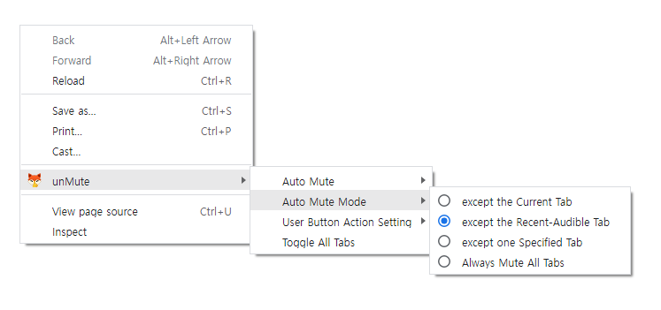

#  unMute

Manually/Automatically Mute your tabs for Chrome.

<span style="font-size:0.8em">_Read this in other languages: [English](README.md), [한국어](README.ko.md)._</span>

### Features

- Mute/unMute Current Tab
- Auto Mute All Tabs except Current/Recent-Audible/Specified Tab
- Always Mute All Tabs
- Toggle state All Tabs
- Change User Button Action

### ChangeLog

- 2.0.0: Migrate to manifest V3 and rewrite whole code

- 1.8: Add auto mute all tabs except the specified tab
- 1.7: Add always mute all tabs
- 1.6: Add option for user action button
- 1.5: Add changelog page and notification
- 1.4: Add auto mute all tabs except the recent-audible tab
- 1.3: Add options page
- 1.2: Add auto mute all tabs except the current tab
- 1.1: Add context menus
- 1.0: Initial release

### Known Issues

- Sometimes extensions freezing (If you change or refresh tab, it will be work)

### ToDo

- improve Options UI
- and more...

### ScreenShot




## License

```

```
