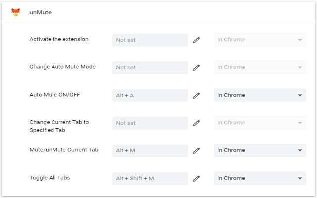
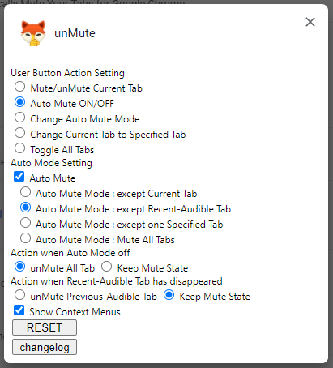

<h1 align="center"> unMute</h1></p>

<p align="center">
Manually/Automatically Mute your tabs for Google Chrome™.
</p>
<p align="center">
<a href="https://chrome.google.com/webstore/detail/unmute/lfedioibcednammacdoioeonimdbpige"></a>
</p><hr>

<span style="font-size:0.75em">_Read this in other languages: [English](README.md), [한국어](README.ko.md)._</span>

## Features

- Mute/unMute Current Tab
- Auto Mute All Tabs except Current/Recent-Audible/Specified Tab
- Always Mute All Tabs
- Toggle state All Tabs
- Change User Button Action

## ChangeLog

- V3

  - 3.0.0: Migrate t0 MV3 (wip)

- V2

  - 2.0.1: Fix action badge color to be visible
  - 2.0.0: Rewrite whole code. Fix all known issues and prepare for manifest v3

- Legacy

  - 1.8: Add auto mute all tabs except the specified tab
  - 1.7: Add always mute all tabs
  - 1.6: Add option for user action button
  - 1.5: Add changelog page and notification
  - 1.4: Add auto mute all tabs except the recent-audible tab
  - 1.3: Add options page
  - 1.2: Add auto mute all tabs except the current tab
  - 1.1: Add context menus
  - 1.0: Initial release

## Known Issues

-

## ToDo

- improve Options UI
- porting for firefox, edge, whale
- and more...

## ScreenShot





## License

```

```
